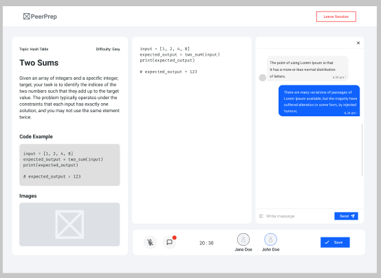

# AI Usage Log

# Wen Cong

## Entry 1
matching-service/src/app.ts, matching-service/src/config/redis.ts, matching-service/src/services/queue.service.ts
## Date/Time:
2026-03-06
## Tool:
GitHub Copilot (model: GPT-5.3-Codex)
## Prompt/Command:
"Generate and refine backend boilerplate for matching-service app setup, Redis client initialization, and queue helper operations."
## Scope:
I used Copilot to draft and clean up implementation code for app setup, Redis initialization, and queue helper logic.
## Output Summary:
I got starter code for service setup and queue utilities, then refined it for this codebase.
# Action Taken:
- [ ] Accepted as-is
- [x] Modified
- [ ] Rejected
## Author Notes:
I reviewed each suggestion, kept what matched our existing code style, and tested middleware and Redis behavior locally.

## Entry 2
matching-service/src/services/matching.service.ts
## Date/Time:
2026-03-07
## Tool:
GitHub Copilot (model: GPT-5.3-Codex)
## Prompt/Command:
"Implement and refactor candidate matching logic for matching-service, including partner selection and service-to-service orchestration."
## Scope:
I used Copilot for implementation help while refactoring candidate matching and partner selection flow.
## Output Summary:
It suggested a baseline matching flow with candidate filtering and orchestration hooks.
## Action Taken:
- [ ] Accepted as-is
- [x] Modified
- [ ] Rejected
## Author Notes:
I walked through the matching flow step by step, adjusted the selection behavior, and verified events manually.

## Entry 3
matching-service/src/clients/question.client.ts
## Date/Time:
2026-03-13
## Tool:
GitHub Copilot (model: GPT-5.3-Codex)
## Prompt/Command:
"Create question-service client scaffolding with typed response handling and resilient error handling patterns."
## Scope:
I used Copilot to draft the question-service client methods and improve error handling code.
## Output Summary:
It produced a first pass of the client structure for random question fetching and error handling.
## Action Taken:
- [ ] Accepted as-is
- [x] Modified
- [ ] Rejected
## Author Notes:
I checked query params and typing against the current API contract and fixed details before keeping the changes.

## Entry 4
matching-service/src/server.ts, matching-service/src/clients/collab.client.ts, peerprep-frontend/src/app/user/page.tsx
## Date/Time:
2026-03-23
## Tool:
GitHub Copilot (model: GPT-5.3-Codex)
## Prompt/Command:
"Refactor Socket.IO server event wiring, collaboration-session client request flow, and user dashboard match criteria state handling."
## Scope:
I used Copilot to help refactor Socket.IO event wiring, collab-client request flow, and dashboard state handling.
## Output Summary:
It suggested refactoring patterns for backend event flow and frontend handler logic.
# Action Taken:
- [ ] Accepted as-is
- [x] Modified
- [ ] Rejected
## Author Notes:
I adapted the suggestions to existing code paths and validated behavior with local runs.

## Entry 5
peerprep-frontend/src/hooks/useMatchingSession.ts
## Date/Time:
2026-03-26
## Tool:
GitHub Copilot (model: GPT-5.3-Codex)
## Prompt/Command:
"Refactor useMatchingSession hook to manage socket lifecycle, timeout handling, notification flow, and connection error paths."
## Scope:
I used Copilot while refactoring the hook's socket lifecycle, timeout logic, and notification flow.
## Output Summary:
It suggested timer cleanup patterns and event/error handling structure for the hook.
# Action Taken:
- [ ] Accepted as-is
- [x] Modified
- [ ] Rejected
## Author Notes:
I rewired callbacks and message handling to fit the current UX, then tested matching and forced logout locally.

## Entry 6
infra/main.tf, infra/variables.tf, infra/outputs.tf, infra/wif.tf, infra/modules/artifact_registry/main.tf, infra/modules/cloud_run/main.tf, infra/modules/databases/main.tf, infra/modules/load_balancer/main.tf, infra/modules/networking/main.tf, infra/modules/secrets/main.tf
## Date/Time:
2026-04-08
## Tool:
GitHub Copilot (model: GPT-5.3-Codex)
## Prompt/Command:
"Generate and refactor Terraform implementation blocks for provider/module wiring, variable/output declarations, workload-identity resources, backend config entries, and reusable module resource definitions; suggest fixes for terraform syntax/runtime issues."
## Scope:
I used Copilot for implementation support while writing/refactoring Terraform blocks and troubleshooting validation issues.
## Output Summary:
It gave me draft Terraform blocks and syntax/debugging suggestions, which I then adjusted to match our setup.
# Action Taken:
- [ ] Accepted as-is
- [x] Modified
- [ ] Rejected
## Author Notes:
I reviewed every snippet, edited values and wiring for our current infra, and ran Terraform checks/plan before keeping changes.

## Entry 7
.github/workflows/deployment-staging.yml, .github/workflows/deployment-prod.yml
## Date/Time:
2026-04-12
## Tool:
GitHub Copilot (model: GPT-5.3-Codex)
## Prompt/Command:
"Refactor GitHub Actions implementation details for deployment workflow job sequencing, conditions, outputs, and command steps; suggest debugging fixes for workflow syntax and execution issues."
## Scope:
I used Copilot to refactor workflow YAML steps, conditionals, and job flow, plus troubleshoot syntax/execution issues.
## Output Summary:
It suggested edits for workflow syntax and step wiring in staging and production pipelines.
# Action Taken:
- [ ] Accepted as-is
- [x] Modified
- [ ] Rejected
## Author Notes:
I checked trigger conditions and job dependencies, edited commands to match our scripts, and validated workflow syntax.

# Kang Jun

## Entry 1
question-service/src/init-db.ts
## Date/Time:
2026-03-08
## Tool:
Claude (model: Sonnet 4.5)
## Prompt/Command:
"Translate this hand-designed schema for a `questions` table (SERIAL id, unique title, description, TEXT[] topics with GIN index, difficulty enum, examples/pseudocode/solution/image_url, timestamps) into Postgres DDL."
## Scope:
I used Claude to convert my schema design into the actual DDL statements.
## Output Summary:
It produced the `CREATE TYPE` / `CREATE TABLE` / `CREATE INDEX` statements matching the design.
# Action Taken:
- [x] Accepted as-is
- [ ] Modified
- [ ] Rejected
## Author Notes:
I verified the DDL against the schema I had planned and ran it locally to confirm the indexes behaved as expected.

## Entry 2
question-service/src/routes/questionRoutes.ts
## Date/Time:
2026-03-08
## Tool:
Claude (model: Sonnet 4.5)
## Prompt/Command:
"Generate Express CRUD routes for list/get/create/update/delete against the `questions` table using `pg`, with input validation."
## Scope:
I used Claude to draft the initial CRUD route handlers for the question service.
## Output Summary:
It produced a first pass of the CRUD Express router.
# Action Taken:
- [ ] Accepted as-is
- [x] Modified
- [ ] Rejected
## Author Notes:
I adjusted the handlers to plug into our auth/role middleware conventions and tightened error responses before merging.

## Entry 3
peerprep-frontend/src/components/admin/QuestionForm.tsx, peerprep-frontend/src/components/admin/QuestionTable.tsx, peerprep-frontend/src/services/questionApi.ts, peerprep-frontend/src/app/admin/questions/create/page.tsx, peerprep-frontend/src/app/admin/questions/[id]/edit/page.tsx
## Date/Time:
2026-03-11
## Tool:
Claude (model: Sonnet 4.5)
## Prompt/Command:
"Generate a Next.js admin dashboard for question CRUD: a QuestionForm with title/description/examples/difficulty/topics/pseudocode/solution inputs, a QuestionTable with edit/delete actions, a fetch-based API client, and create/edit pages wiring them together, styled with Tailwind."
## Scope:
I used Claude to generate the admin question CRUD UI, API client, and the create/edit pages.
## Output Summary:
It produced the form, table, API client, and two page components in Tailwind-styled React.
# Action Taken:
- [ ] Accepted as-is
- [x] Modified
- [ ] Rejected
## Author Notes:
I reviewed types, adjusted routing constants, and verified the UI against the backend before keeping the code.

## Entry 4
.github/workflows/ci.yml, question-service/src/__tests__/integration.test.ts
## Date/Time:
2026-04-05
## Tool:
Claude (model: Sonnet 4.5)
## Prompt/Command:
"Translate this hand-designed CI pipeline (paths-filter → per-service matrix of npm ci/typecheck/test/build, frontend lint+build, Docker image verify) into GitHub Actions YAML, and generate a Testcontainers + Supertest integration harness for question-service with initial CRUD test cases."
## Scope:
I used Claude to convert my CI design into YAML and to scaffold the integration test harness.
## Output Summary:
It produced the GitHub Actions workflow and a Testcontainers-backed integration test file.
# Action Taken:
- [ ] Accepted as-is
- [x] Modified
- [ ] Rejected
## Author Notes:
I adjusted service paths, Node version, and added edge-case coverage before merging.

## Entry 5
question-service/src/seed.ts
## Date/Time:
2026-04-05
## Tool:
Claude (model: Sonnet 4.5)
## Prompt/Command:
"Given these LeetCode questions from the Kaggle dataset (https://www.kaggle.com/datasets/gzipchrist/leetcode-problem-dataset) which lacks worked answers, generate model solutions for the Sort and Stacks/Queues topics matching the existing Question interface."
## Scope:
I used Claude to generate model solutions for questions where the Kaggle source did not include answers.
## Output Summary:
It produced worked solutions and example blocks for the requested topic batches.
# Action Taken:
- [ ] Accepted as-is
- [x] Modified
- [ ] Rejected
## Author Notes:
I reviewed each solution for correctness, trimmed/reformatted content to match the schema, and validated via the seed script against the integration test suite.

## Entry 6
question-service/src/routes/questionRoutes.ts, question-service/src/__tests__/integration.test.ts
## Date/Time:
2026-04-07
## Tool:
Claude (model: Sonnet 4.5)
## Prompt/Command:
"Add a `/random-unattempted` endpoint that takes { userAId, userBId, topics, difficulties }, calls the collaboration service for each user's attempted question IDs, and picks a random matching question neither has attempted; include integration tests using nock."
## Scope:
I used Claude to generate the random-unattempted endpoint and its integration tests.
## Output Summary:
It produced the new endpoint plus the corresponding test cases.
# Action Taken:
- [x] Accepted as-is
- [ ] Modified
- [ ] Rejected
## Author Notes:
I verified the service-to-service call and confirmed the tests ran green locally and in CI.

# Derek Qua

## Entry 1: Verify Email (SVG/Icon)
**File:** peerprep-frontend/src/app/auth/verify-email/page.tsx

## Date/Time:
2026-04-02

## Tool:
Claude

## Prompt/Command:
"Create a React SVG component for a verify email page icon/illustration. It should represent email verification status in a clean minimal style suitable for a Next.js frontend empty/feedback state."

## Output Summary:
Generated a React-compatible SVG component representing email verification status. The design was minimal, scalable, and suitable for use in a verification feedback UI.

## Action Taken:
- [x] Accepted as-is
- [ ] Modified
- [ ] Rejected

## Author Notes:
Integrated SVG into verify email page UI and used it directly without modification.

---

## Entry 2: Attempt History (Empty State SVG)
**File:** peerprep-frontend/src/components/attempt/AttemptHistoryTable.tsx

## Date/Time:
2026-04-05

## Tool:
Claude

## Prompt/Command:
"Generate a React SVG component for an empty state in a User Attempt History page. It should visually represent no past attempts (e.g., empty document, clock, or history icon) in a minimal and clean style."

## Output Summary:
Generated a React SVG component for an empty state UI in the Attempt History page.

## Action Taken:
- [x] Accepted as-is
- [ ] Modified
- [ ] Rejected

## Author Notes:
Integrated SVG directly into Attempt History empty state without changes.

---

## Entry 3: Forbidden Page (SVG/Icon)
**File:** peerprep-frontend/src/components/ForbiddenPage.tsx

## Date/Time:
2026-04-11

## Tool:
Claude

## Prompt/Command:
"Create a React SVG component for a forbidden/access denied page. It should visually represent restricted access (e.g., lock, shield, or blocked symbol) in a minimal and clean style suitable for a Next.js frontend."

## Output Summary:
Generated a React SVG component representing a forbidden/access denied state.

## Action Taken:
- [x] Accepted as-is
- [ ] Modified
- [ ] Rejected

## Author Notes:
Used SVG directly in forbidden page without modification.

---

## Entry 4: ESLint + React Hooks Debugging
**File:** peerprep-frontend/src/context/AuthContext.tsx, peerprep-frontend/src/components/admin/QuestionsTab.tsx, peerprep-frontend/src/components/admin/UsersTab.tsx, peerprep-frontend/src/components/profile/EditProfileModal.tsx, peerprep-frontend/src/app/admin/page.tsx

## Date/Time:
2026-04-06 21:00

## Tool:
ChatGPT (GPT-5.3)

## Prompt/Command:
"Help me fix ESLint errors in my Next.js TypeScript project, including react-hooks/set-state-in-effect, no-explicit-any, and unescaped entities errors."

## Output Summary:
Explained causes of ESLint errors and suggested fixes including:
- Avoid calling setState directly inside useEffect
- Replace `any` with proper TypeScript types
- Escape special characters in JSX
- Fix missing dependencies in useEffect
- Suggested replacing `` with Next.js `<Image />`

## Action Taken:
- [ ] Accepted as-is
- [x] Modified
- [ ] Rejected

## Author Notes:
Applied fixes across multiple frontend files. Refactored state logic, improved typing, and resolved lint issues after testing.

---

## Entry 5: React Hooks Refactoring
**File:** peerprep-frontend/src/context/AuthContext.tsx, peerprep-frontend/src/components/admin/QuestionsTab.tsx, peerprep-frontend/src/components/admin/UsersTab.tsx, peerprep-frontend/src/components/profile/EditProfileModal.tsx, peerprep-frontend/src/app/admin/page.tsx

## Date/Time:
2026-04-06 21:10

## Tool:
ChatGPT (GPT-5.3)

## Prompt/Command:
"How to fix react-hooks/set-state-in-effect error when setting state based on searchParams or props?"

## Output Summary:
Suggested alternative patterns:
- Derive state directly instead of using useEffect
- Use useMemo or conditional initialization
- Move logic outside of effect where possible

## Action Taken:
- [ ] Accepted as-is
- [x] Modified
- [ ] Rejected

## Author Notes:
Refactored components to derive state from props/searchParams instead of setting state in useEffect. Reduced unnecessary re-renders.

---

## Entry 6: TypeScript Lint Fixes
**File:** peerprep-frontend/src/context/AuthContext.tsx, peerprep-frontend/src/components/admin/QuestionsTab.tsx, peerprep-frontend/src/components/admin/UsersTab.tsx, peerprep-frontend/src/components/profile/EditProfileModal.tsx, peerprep-frontend/src/app/admin/page.tsx

## Date/Time:
2026-04-06 21:15

## Tool:
ChatGPT (GPT-5.3)

## Prompt/Command:
"Fix TypeScript lint error for Boolean vs boolean and avoid explicit any."

## Output Summary:
Recommended:
- Replace `Boolean` with `boolean`
- Define proper interfaces instead of `any`

## Action Taken:
- [ ] Accepted as-is
- [x] Modified
- [ ] Rejected

## Author Notes:
Updated type definitions in API and components. Ensured type safety and removed lint warnings.

---

## Entry 7: Login Page Fix (URL Query + useEffect Issue)
**File:** peerprep-frontend/src/app/auth/login/page.tsx

## Date/Time:
2026-04-13 21:25

## Tool:
ChatGPT (GPT-5.3)

## Prompt/Command:
"Fix react-hooks/set-state-in-effect error in a Next.js login page where state is set based on URL query parameters. Also explain missing dependency warnings in useEffect."

## Output Summary:
Suggested:
- Avoid setting state inside useEffect for derived values
- Compute error message directly from URL query parameters instead of state
- Alternative patterns like derived variables or conditional rendering
- Fix dependency warnings by restructuring logic

## Action Taken:
- [ ] Accepted as-is
- [x] Modified
- [ ] Rejected

## Author Notes:
Refactored login page to derive error state from query parameters instead of using useEffect. Verified correctness via linting and testing.

---

## Entry 8: PeerPrep Logo (SVG/Icon)
**File:** peerprep-frontend/src/components/navbar/Navbar.tsx, peerprep-frontend/src/app/page.tsx

## Date/Time:
2026-04-13

## Tool:
Claude

## Prompt/Command:
"Generate a simple React SVG logo for a project called PeerPrep. The logo should be minimal, modern, and suitable for a coding/interview preparation platform. Output as a reusable React SVG component using currentColor for theme support."

## Output Summary:
Generated a React SVG logo component representing the PeerPrep brand. The design is minimal and scalable, suitable for use in a navbar or landing page header.

## Action Taken:
- [x] Accepted as-is
- [ ] Modified
- [ ] Rejected

## Author Notes:
Integrated logo directly into frontend UI (header/navbar). Ensured consistent styling with application theme and verified rendering.

## Entry 9: Avatar Config Unit Tests
**File:** user-service/src/__tests__/config/avatar.test.ts

## Date/Time:
2026-04-05

## Tool:
Claude

## Prompt/Command:
Generated Jest unit tests for avatar utility functions (getDefaultAvatar and getRandomAvatar). Requested coverage for URL validation, bucket URL correctness, and ensuring generated avatar keys exist in predefined AVATAR_OPTIONS.

## Output Summary:
Generated unit tests covering:
- Default avatar URL generation
- Random avatar URL format validation
- Verification of correct GCS bucket URL usage
- Validation against known avatar option keys

## Action Taken:
- [x] Accepted as-is
- [ ] Modified
- [ ] Rejected

## Author Notes:
Integrated generated test suite into avatar config tests to improve coverage and validate utility correctness.

---

## Entry 10: Auth Controller Unit Tests
**File:** user-service/src/__tests__/controllers/authController.test.ts

## Date/Time:
2026-04-05

## Tool:
Claude

## Prompt/Command:
Generate Jest unit tests for Express authentication controllers including registerUser, loginUser, verifyEmail, and resendVerification. Include mocking of AuthService methods and test both success and error cases such as successful registration, login returning JWT token, missing verification token, and resend verification email success response.

## Output Summary:
Generated Jest test suite for authentication controller functions. Tests included:
- User registration success and error handling via mocked AuthService
- Login flow returning JWT token and user data
- Email verification with missing token and valid token scenarios
- Resend verification email success response handling
- Mocking of AuthService methods using Jest

## Action Taken:
- [x] Accepted as-is
- [ ] Modified
- [ ] Rejected

## Author Notes:
Integrated generated test cases into authentication controller test suite to improve coverage of API endpoints and service interactions. Verified correctness through Jest test execution.

---

## Entry 11: User Controller Unit Tests
**File:** user-service/src/__tests__/controllers/userController.test.ts

## Date/Time:
2026-04-05

## Tool:
Claude

## Prompt/Command:
Generate comprehensive Jest unit tests for Express user controller functions including getProfile, deleteUser, updateUserProfile, updatePassword, updateProfileIcon, getAvatarOptions, createAdmin, banUser, and getProfilesForService. Include mocking of UserService methods, validation error cases, and success responses. Ensure coverage includes invalid input handling, missing parameters, and successful service interactions.

## Output Summary:
Generated Jest test suite for multiple user controller endpoints. Coverage included:
- Profile retrieval and 404 handling
- User deletion success and not-found cases
- Profile update validation (email/password checks)
- Password update schema validation and success flow
- Profile icon update validation
- Avatar options retrieval with environment-based bucket URL
- Admin creation success flow
- User ban functionality
- Batch profile retrieval with missing/valid ID handling
- Mocking of UserService methods using Jest

## Action Taken:
- [x] Accepted as-is
- [ ] Modified
- [ ] Rejected

## Author Notes:
Integrated generated tests into user controller test suite to improve backend API coverage. Verified correctness through Jest execution and ensured proper mocking of service layer dependencies.

---

---

## Entry 12: Error Handler Unit Tests (handleAppError)
**File:** user-service/src/__tests__/errors/handleAppError.test.ts

## Date/Time:
2026-04-05

## Tool:
Claude

## Prompt/Command:
Generate Jest unit tests for an Express error handling utility function handleAppError. Include test cases for AppError with specific error codes such as EMAIL_EXISTS, correct HTTP status and message handling, Zod validation errors returning 400 status, and unknown errors returning 500 with a fallback message. Ensure correct usage of Express Response mock methods (status and json) and validate HTTP responses for each case.

## Output Summary:
Generated Jest test suite for handleAppError covering multiple error scenarios:
- Custom AppError handling with specific error code (EMAIL_EXISTS), status, and message
- Zod validation error handling returning HTTP 400
- Generic unknown error handling returning HTTP 500 with fallback message
- Proper mocking of Express Response object methods

## Action Taken:
- [x] Accepted as-is
- [ ] Modified
- [ ] Rejected

## Author Notes:
Integrated generated tests into error handling test suite. Verified correct HTTP response behavior across all error types using Jest.

---

## Entry 13: Authentication Middleware Unit Tests
**File:** user-service/src/__tests__/middleware/authMiddleware.test.ts

## Date/Time:
2026-04-05

## Tool:
Claude

## Prompt/Command:
Generate Jest unit tests for Express authentication middleware functions including authenticateToken and authenticateServiceToken. Include test cases for missing JWT token, invalid JWT token, valid token decoding, banned or deleted user checks, and service token validation. Mock jsonwebtoken, UserDB, and BanService dependencies. Ensure correct Express middleware behavior including calling next() and returning proper HTTP status codes.

## Output Summary:
Generated Jest test suite for authentication middleware covering:
- Missing authorization token returning 401
- Invalid JWT token returning 403
- Valid token decoding and attaching user to request object
- Handling of deleted user accounts with USER_DELETED error code
- Service token authentication success and failure cases
- Mocking of JWT verification, UserDB, and BanService methods

## Action Taken:
- [x] Accepted as-is
- [ ] Modified
- [ ] Rejected

## Author Notes:
Integrated generated middleware tests into authentication test suite. Verified correct Express middleware behavior including authorization handling, token validation, and proper invocation of next().

---

## Entry 14: AuthService Unit Tests (Registration, Login, Verification, Resend)
**File:** user-service/src/__tests__/services/authServices.test.ts

## Date/Time:
2026-04-05

## Tool:
Claude

## Prompt/Command:
Generate comprehensive Jest unit tests for AuthService including register, login, verifyEmail, and resendVerification functions. Include mocking for UserDB, VerificationDB, bcrypt, and jsonwebtoken. Ensure coverage for error cases such as EMAIL_EXISTS, USERNAME_EXISTS, USER_NOT_FOUND, USER_BANNED, EMAIL_NOT_VERIFIED, INVALID_PASSWORD, INVALID_TOKEN, TOKEN_EXPIRED, and ALREADY_VERIFIED. Also include success flows for user registration, login with JWT generation, email verification, and resend verification email logic.

## Output Summary:
Generated Jest test suite for AuthService covering:
- User registration validation (email/username conflicts)
- Successful user creation with password hashing and verification token generation
- Login flow with multiple failure cases (not found, banned, unverified, invalid password)
- Successful login returning JWT token and user data
- Email verification with token validation, expiry handling, and user verification update
- Resend verification email logic with validation for unregistered or already verified users
- Mocking of UserDB, VerificationDB, bcrypt, and JWT dependencies

## Action Taken:
- [x] Accepted as-is
- [ ] Modified
- [ ] Rejected

## Author Notes:
Integrated generated service-level tests into authentication test suite. Verified correctness of business logic flows including authentication, verification lifecycle, and error handling behavior.

---

## Entry 15: UserService Unit Tests (User Management)
**File:** user-service/src/__tests__/services/userServices.test.ts

## Date/Time:
2026-04-05

## Tool:
Claude

## Prompt/Command:
Generate comprehensive Jest unit tests for UserService including deleteUser, updatePassword, banUser, and createAdmin functions. Include mocking of UserDB and bcrypt dependencies. Ensure coverage for error cases such as SELF_DELETE, INCORRECT_PASSWORD, USER_DB_NOT_FOUND, CANNOT_BAN_ADMIN, and EMAIL_EXISTS. Also include success scenarios such as password hashing and update, user deletion, banning/unbanning users, and admin creation.

## Output Summary:
Generated Jest test suite for UserService covering:
- User deletion with self-deletion protection and valid deletion flow
- Password update with incorrect password handling and successful bcrypt hashing/update
- User banning logic with validation for self-ban, missing user, and admin restriction cases
- Admin creation with duplicate email/username validation and successful admin creation
- Mocking of UserDB and bcrypt dependencies for controlled test behavior

## Action Taken:
- [x] Accepted as-is
- [ ] Modified
- [ ] Rejected

## Author Notes:
Integrated generated service-level tests into UserService test suite. Verified correct business logic enforcement including validation rules, password security handling, and user role constraints.

---

## Entry 16: Role-Based Authorization Middleware Unit Tests
**File:** user-service/src/__tests__/middleware/roleMiddleware.test.ts

## Date/Time:
2026-04-05

## Tool:
Claude

## Prompt/Command:
Generate Jest unit tests for Express role-based authorization middleware authorizeRoles. Include test cases for missing user role, unauthorized role access, authorized single role access, and multiple allowed roles. Ensure correct Express middleware behavior including returning HTTP 403 for unauthorized access and calling next() for valid roles.

## Output Summary:
Generated Jest test suite for authorizeRoles middleware covering:
- Missing user role resulting in 403 response
- User with invalid role being denied access (403)
- Valid role matching single allowed role passing through middleware
- Valid role matching one of multiple allowed roles passing through middleware
- Mocking Express Request, Response, and NextFunction behavior

## Action Taken:
- [x] Accepted as-is
- [ ] Modified
- [ ] Rejected

## Author Notes:
Integrated generated middleware tests into role-based authorization test suite. Verified correct access control behavior and middleware flow control using Jest.

# Yan Xu

## Entry 1
collaboration-service/src/realtime.ts collaboration-service/src/app.ts collaboration-service/src/index.ts peerprep-frontend/src/app/collaboration/[roomId]/page.tsx peerprep-frontend/src/app/collaboration/[roomId]/room.module.css peerprep-frontend/src/components/collaboration/CodeEditor.tsx
## Date/Time:
2026-03-12
## Tool:
ChatGPT 5.3
## Prompt/Command:
"We have finalized our architecture using Express, TypeScript, and PostgreSQL, and decided to use CodeMirror for the code editor. Based on our frontend component boundaries shown in this mockup , please generate the initial React boilerplate for the UI components and the basic Express boilerplate for the backend to match our design."
## Scope:
I used ChatGPT to generate the initial boilerplate code for the frontend components and backend routes based on our finalized architecture and component boundaries.
## Output Summary:
It generated boilerplate React components and an Express scaffold matching our design specs.
# Action Taken:
- [ ] Accepted as-is
- [x] Modified
- [ ] Rejected
## Author Notes:
The initial code is not what was envisioned and was full of bugs. It is heavily modified as the project progresses

## Entry 2
collaboration-service/Dockerfile
## Date/Time:
2026-03-23
## Tool:
ChatGPT 5.3
## Prompt/Command:
"Based on your understanding of my peerprep project, could you help me generate a Dockerfile?"
## Scope:
I used ChatGPT to generate a Dockerfile for the collaboration service
## Output Summary:
It provided me with the Dockerfile
# Action Taken:
- [x] Accepted as-is
- [ ] Modified
- [ ] Rejected
## Author Notes:
The Dockerfile is kept as is as it works well

## Entry 3
peerprep-frontend/src/components/collaboration/VoiceChat.tsx collaboration-service/src/realtime.ts peerprep-frontend/src/app/collaboration/[roomId]/page.tsx
## Date/Time:
2026-03-28
## Tool:
ChatGPT 5.3
## Prompt/Command:
"We are adding a WebRTC voice call feature. I have defined the signaling architecture and endpoint interfaces between the frontend React app and backend Express server. Could you generate the implementation code for the WebRTC peer connection and signaling logic to fit this architecture?"
## Scope:
I used ChatGPT to implement WebRTC peer connection and signaling logic based on our finalized signaling architecture and service interfaces.
## Output Summary:
It generated the specific implementation code for the WebRTC components to integrate with our existing designed interfaces.
# Action Taken:
- [ ] Accepted as-is
- [x] Modified
- [ ] Rejected
## Author Notes:
The initial code is modified to get the integration to work. Furthermore more changes are added as the project progresses

## Entry 4
nginx/default.conf
## Date/Time:
2026-03-28
## Tool:
ChatGPT 5.3
## Prompt/Command:
"The Voice call feature requires HTTPS to work. As the services of peerprep are currently hosted on HTTP, could you help me generate a nginx configuration file to reverse proxy all the traffic onto HTTPS? The collaboration service is on http://collaboration-service:3001/, the frontend is on http://peerprep-frontend:3000/, the matching service is on http://matching-service:3002/, the user service is on http://user-service:3004/ and the question service is on http://question-service:3003/"
## Scope:
I used ChatGPT to generate a initial base NGINX configuration file to get voice call to work
## Output Summary:
It provided me with the initial base NGINX configuration file with routes to each of the services
# Action Taken:
- [ ] Accepted as-is
- [x] Modified
- [ ] Rejected
## Author Notes:
The initial code is modified as the project progresses

## Entry 5
peerprep-frontend/src/components/collaboration/SocketIO-YJS-provider.ts collaboration-service/src/realtime.ts peerprep-frontend/src/app/collaboration/[roomId]/page.tsx
## Date/Time:
2026-03-30
## Tool:
ChatGPT 5.3
## Prompt/Command:
"We are implementing CRDT for our CodeMirror editor using YJS. Based on our existing WebSocket event architecture, please generate the boilerplate implementation for the YJS document synchronization logic on both the frontend and backend."
## Scope:
I used ChatGPT to implement the YJS CRDT synchronization logic according to my predefined WebSocket event architecture.
## Output Summary:
It generated the structural implementation code to synchronize the YJS document state across our predefined boundaries.
# Action Taken:
- [ ] Accepted as-is
- [x] Modified
- [ ] Rejected
## Author Notes:
The initial code is modified as the project progresses

## Entry 6
collaboration-service/src/__tests__/attempts/collaboration.test.ts
## Date/Time:
2026‑04‑14
## Tool:
ChatGPT 5.4
## Prompt/Command:
"Based on the collaboration service code, please generate Jest unit tests for the following scenarios I defined: user connection, concurrent document editing, and user disconnection handling."
## Scope:
I designed the test cases and used ChatGPT to generate the initial Jest implementation code for the collaboration service.
## Output Summary:
It provided me with the test implementation code for my predefined scenarios.
# Action Taken:
- [ ] Accepted as-is
- [x] Modified
- [ ] Rejected
## Author Notes:
The initial tests is changed while debugging

## Entry 7
collaboration-service/jest.config.js
## Date/Time:
2026‑04‑14
## Tool:
ChatGPT 5.4
## Prompt/Command:
"I have some errors with running the collaboration service tests. Could you help me configure Jest to handle dependencies such as yjs, y-protocols, and lib0?"
## Scope:
I used ChatGPT to generate the regex to handle yjs, y-protocols, and lib0 dependencies and install the correct dependencies
## Output Summary:
It provided me with the initial regex
# Action Taken:
- [ ] Accepted as-is
- [x] Modified
- [ ] Rejected
## Author Notes:
The output is not used directly as-is. I adjusted the Jest configuration while debugging and verified the final setup by rerunning the collaboration service tests

